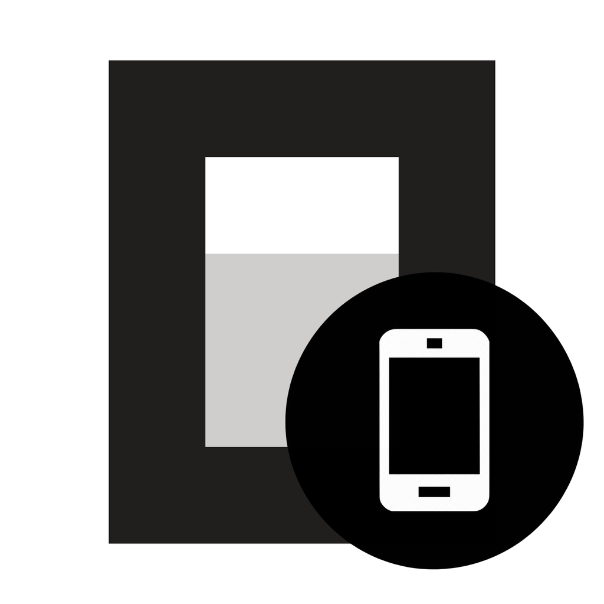

<p align="center"></p>

<h1 align="center">Pocket Control</h1>

[](LICENSE)
[](https://github.com/sponsors/rifqi2320)


Pocket Control is a phone app for keeping an eye on your [OpenCode](https://opencode.ai) v2 sessions. It lists what needs your attention first, lets you reply to permission requests and questions, send prompts and interrupt runs, and can push a notification when a session needs you.

It only shows live data. Until a server connection succeeds, the home screen is empty. It never shows sample sessions.

> **Status:** 0.1.0, early. The web build is fine for UI review. Test native HTTPS and event streams on a real device before you leave the app watching unattended work.

## Features

- **Attention first.** Sessions waiting on a permission or a question sort above sessions that are just running.
- **Multiple servers.** Each server keeps its own name and project in the list and in the detail view.
- **Two list views.** Group sessions by status (what needs you, failed, working, recent) or by project folder. The toggle next to the filter switches views, and the app remembers your choice.
- **Start sessions from the phone.** Tap **+** in the header, or the **+** next to a project in the project view. Enter a folder name the server already knows, or an absolute path. If the folder doesn't exist on the server, the app shows an error instead of creating the session.
- **Honest states.** Offline, auth failure, version mismatch and partial data each have their own UI. A prompt shows as acknowledged by the server, not as finished.
- **Forms.** Answer OpenCode questions and permission requests from the phone. If this build can't render a form, the app sends you to the OpenCode client instead of guessing an answer.
- **Push notifications (Android).** Optional. Needs the companion [OpenCode plugin](plugin/README.md), which works with no setup: it sends through the Expo Push Service, so you don't need a Firebase project or any keys. You choose on the phone which events notify you. The plugin's options decide which events a server offers at all.
- **Light and dark mode.** Follows the system setting.

## Repository layout

| Path | What it is |
| --- | --- |
| `App.tsx`, `src/ui/` | Expo / React Native app: screens, design system, view models |
| `src/core/` | Networking, persistence, query snapshots, mutations, notification logic |
| `plugin/` | `@pocket/opencode-plugin`, the OpenCode server plugin for FCM push ([README](plugin/README.md)) |
| `compatibility/` | The OpenCode v2 contract this build is pinned to |
| `scripts/` | Contract smoke test against a live OpenCode server |
| `docs/` | [Product requirements](docs/prd.md) and [technical design](docs/technical-design.md) |

## Getting started

Requirements: Node.js 20.19+ and npm. Native builds also need the iOS/Android toolchains that Expo requires.

```sh
npm install
npm run start      # Expo dev server
npm run android    # native Android build
npm run ios        # native iOS build
npm run web        # browser
```

Checks:

```sh
npm run typecheck  # tsc
npm test           # node --test
npm run check      # typecheck + static web export
cd plugin && npm test
```

### Android build

```sh
npx expo prebuild --clean
npm run android                                  # local debug build
npx eas-cli build -p android --profile preview   # installable APK built by EAS
```

The repo ships the project's `google-services.json` (the Firebase client config every Android app embeds; it isn't a secret) and the Expo project id in `app.json`, so builds get working push out of the box.

**Forks that publish their own app** need their own Firebase project (replace `google-services.json` and keep the package name in sync), their own Expo project (`eas init`), and must upload an FCM V1 service-account key to Expo (`eas credentials -p android` → Google Service Account → FCM V1). Use a service account with only the *Firebase Cloud Messaging API Admin* role, and never commit it.

## Connecting a server

Open **Servers → +**, enter an HTTPS URL and the server password if one is set, then connect.

- Server profiles and delivery receipts are stored in AsyncStorage (localStorage on web).
- Passwords are stored in Expo SecureStore on iOS/Android. On web they go in localStorage, which is **not encrypted**, so only use a browser profile you trust.
- Don't put credentials in the URL.
- The phone must already be able to reach the server. Pocket Control does not set up servers or VPNs, does not bypass TLS, and does not follow redirects to another origin.

## Starting a session

**Sessions → +** (or the **+** beside a project in the project view) opens the new-session form. Pick the server, then enter a folder:

- A **folder name** such as `my-api` works when exactly one folder with that name already has sessions on the server. The chips below the field list known folders.
- An **absolute path** such as `/home/me/code/my-api` works for any existing folder on the server.
- `~` paths and relative paths are rejected. The server can't expand `~`, and it would resolve relative paths against its own working directory.

Before creating anything, the app asks the server whether the folder exists (`GET /api/location`). If it doesn't, you get an error and no session is created. On success, the new empty session opens so you can send the first prompt.

## Notifications (Android)

1. Install the [Pocket plugin](plugin/README.md) on the OpenCode server. Without it, everything else still works and the server row shows **Plugin not installed**.
2. In **Servers → (server)**, turn on **Notifications**. The app asks for notification permission and registers this device's push token at `POST {server}/api/rpc/pocket/upsertDevice`, using the same URL and password as other requests. It uses an Expo push token with plugin 0.3.0+, and a raw FCM token with older plugins (which need their own Firebase credentials).
   - Only the servers you turn this on for get the token, so only they can push to this phone.
3. Choose which events notify you: permission requests, questions, failures, finished sessions, interrupted sessions, and whether subagents count for the last three. You can also hide details on the lock screen or tap **Send test**. The phone only shows toggles for events the server's plugin offers (see [plugin options](plugin/README.md#options)); plugin 0.1.x servers show the original four.

A push only tells the app to look. Tapping one refreshes from live OpenCode state and opens the session. The payload carries an opaque `pairingId`, never the server URL. There are two channels: `pocket-attention` (high priority) and `pocket-updates`. iOS push (APNs) and web push are not supported yet.

## UI preview

In a web dev build, `http://localhost:8081/#preview/sessions` shows the screens with fixture data. The other previews are `#preview/projects`, `#preview/detail`, `#preview/servers` and `#preview/empty`.

## Contributing

Issues and pull requests are welcome. See [CONTRIBUTING.md](CONTRIBUTING.md) for setup, checks and guidelines.

## Sponsor

If Pocket Control saves you trips back to your desk, please consider [sponsoring on GitHub](https://github.com/sponsors/rifqi2320). Sponsorships help pay for continued work on the app and the plugin.

## License

[MIT](LICENSE) © 2026 Rifqi Naufal Abdjul
